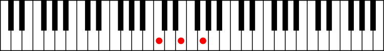

[](https://www.webcomponents.org/element/custom-piano-keys)
[](https://badge.fury.io/js/custom-piano-keys)
[](https://badgen.net/badge/minified/5%20kB/blue)
[](https://badgen.net/badge/minified%20&%20compressed/2%20kB/blue)

# custom-piano-keys
A web component for creating custom HTML elements that depict piano keys.

Live demos available at [here](http://51.38.51.120/pianokeysdemo/) and [here](http://51.38.51.120/pianokeysdemo_2/)



## Features
Custom-piano-keys is a stand-alone vanilla JS web component that does not use shadow DOM.

Following component attributes are configurable:

- element height
- octave width
- number of octaves
- stroke width
- black key height and width
- marked keys
- mark color, shape, diameter and shift

## Including the component to an HTML file

1. Import polyfill, this is not needed for modern browsers:

    ```html
    <script src="https://cdnjs.cloudflare.com/ajax/libs/custom-elements/1.2.4/custom-elements.min.js"></script>
    ```

2. Import custom element:

    ```html
    <script defer src='custom-piano-keys.min.js'></script>
    ```

3. Start using it!

    ```html
    <custom-piano-keys />
    ```
## Including the component from NPM

1. Install and import polyfill, this is not needed for modern browsers:

   See https://www.npmjs.com/package/@webcomponents/custom-elements

2. Install custom-piano-keys NPM package:

    ```console
    npm i custom-piano-keys
    ```

3. Import custom element:

    ```javascript
    import 'custom-piano-keys'
    ```

4. Start using it:

   ```javascript
   var pianokeys = document.createElement("custom-piano-keys")
   pianokeys.setAttribute("marked-keys", "1 5 8")
   document.body.appendChild(pianokeys)
   ```

## Attributes

Name            | Type      | Description             | Unit / Values                                | Default value
---             | ---       | ---                     | ---                                          | ---
oct-count       | Number    | Number of octaves       |Zero or positive integer                      | 1
height          | Number    | Element height          |Element height in pixels                              | 100
oct-w-factor    | Number    | Octave width factor     |Factor producing the width from element height        | 1.5
stroke-w        | Number    | Stroke width            |0 - 100 percents of element height                    | 2
b-key-h         | Number    | Black key height        |0 - 100 percents of element height                    | 60
b-key-w         | Number    | Black key width         |0 - 100 percents of white key width           | 50
marked-keys     | List      | Marked keys             |Space separated list of integers*            | N/A
mark-color      | String/Hex| Mark color              |Color keyword / 3 digit hex / 6 digit hex**     | red
mark-shape      | String    | Mark shape              | circle / rect                                | circle
mark-diameter   | Number    | Mark diameter           |0 - 100 percents of white key width           | 40
b-key-mark-shift| Number    | Black key mark shift    |1 - 100 percents of black key height          | 50
w-key-mark-shift| Number    | White key mark shift    |1 - 100 percents of the white key stub height | 50

*Valid values for marked-keys are integers from 1 to 96.

**Setting color to black will display black marks on white keys and white marks on black keys

## License
Copyright (c) 2019 Jussi Utunen

Licensed under the MIT License
